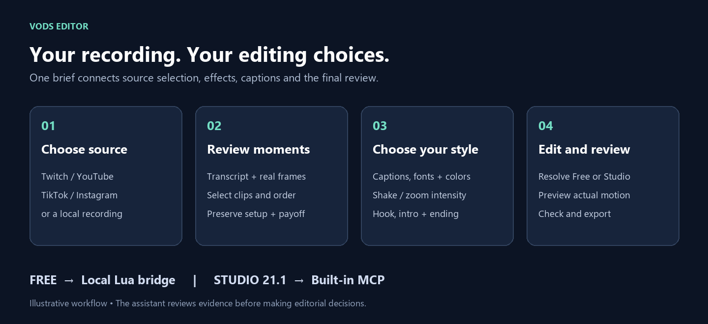
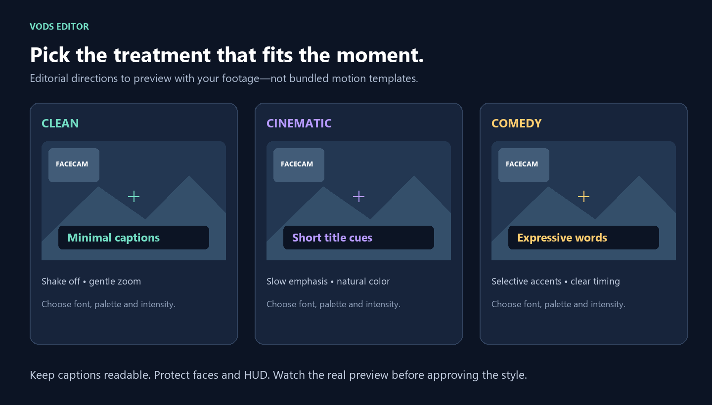

# VODs Editor

Turn a stream recording into reviewed highlights, vertical clips and YouTube montages with Claude Code or Codex and DaVinci Resolve.

Choose your clips, captions, colors and motion style through the assistant's available selection controls. Keep shakes restrained, hooks grounded in the footage, and intro/outro cuts complete. Works with individual **Twitch, YouTube, TikTok and Instagram** video links, or local recordings.



This is an assistant workflow, portable download/analysis helpers, and two skills—not a standalone automatic video editor. The assistant reviews candidates and uses Resolve tools to build the edit. Speech and loudness cues do not automatically recognize kills or funny moments.

## Install by pasting the link

Open **Claude Code** (or the **Code** tab in Claude Desktop, or Codex) in any folder and paste one of these messages:

> Set up this video editing workflow for me: https://github.com/ahmedsalman74/vods-editor — read its AGENTS.md first and follow it step by step. Ask me before installing anything.

> جهّزلي الورك فلو ده للمونتاج: https://github.com/ahmedsalman74/vods-editor — اقرا ملف AGENTS.md الأول وامشي عليه خطوة خطوة، واسألني قبل ما تنزّل أي حاجة، وكلّمني بالعربي.

The assistant checks your PC, installs what is missing with your approval, sets up the skills and the Resolve connection, and tells you when to restart. Then send it a stream link to edit. You only need to do one thing yourself: click **Workspace → Scripts → resolve_mcp_bridge** in Resolve Free. AI assistants: see [AGENTS.md](AGENTS.md).

The manual steps below do the same thing by hand.

## Choose your Resolve connection

| Edition | Connection | Status |
|---|---|---|
| **Resolve Free** | Bundled community Lua MCP + script inside Resolve | Read-only connection tested on Windows Free 21.1.0.17 |
| **Resolve Studio 21.1** | Built-in MCP via **File → Setup AI Assistants** | Verified against Blackmagic's manual; not runtime-tested in this project |

Studio is the paid edition, sometimes called “Pro.” The Free bridge does not unlock Studio effects. Older Resolve versions are not verified here.

## Quick start on Windows

### 1. Install the prerequisites

Install Resolve and your preferred assistant yourself, then run the missing prerequisite commands in PowerShell:

```powershell
winget install -e --id Python.Python.3.12
winget install -e --id OpenJS.NodeJS.LTS
winget install -e --id Git.Git
winget install -e --id Gyan.FFmpeg
```

Close and reopen PowerShell and the assistant after installation. Check:

```powershell
py -3.12 --version
node --version
git --version
ffmpeg -version
```

Python 3.12 is recommended (3.11+ required), and the Free MCP requires Node.js 20+. FFmpeg must include `ffprobe`. Resolve, assistant accounts and any paid features have their own licenses. This project's installer does not install Resolve or buy subscriptions.

### 2. Clone and set up

```powershell
git clone https://github.com/ahmedsalman74/vods-editor.git
cd vods-editor
py -3.12 scripts/setup.py --edition free --client claude-code --data-dir D:\VodsEditor --analysis
```

Choose a real data location with plenty of free space; omit `--data-dir` to use `Documents\VodsEditor`. Use an ASCII-only data path for the Free bridge.

- Change `--client` to `codex`, `claude-desktop`, or `all` as needed.
- **Studio:** use `--edition studio`, then follow the [native connection guide](docs/studio.md).
- `--analysis` installs Whisper/PyTorch for transcription. It is a large download; omit it if you only need the skills and MCP. Model weights download on first analysis.
- Add `--dry-run` to see target paths without changing anything.
- Existing skills or a different `davinci-resolve` registration cause setup to stop. Use `--replace` deliberately to back up and replace those named entries. Other MCP servers are preserved. Backups stay in `.local/backups`.

Setup creates `.venv`, installs the two skills for Code/Codex, builds the Free MCP when selected, and merges the selected client's MCP configuration. Keep this clone in place: installed configuration points to it.

### 3. Connect Resolve Free

```powershell
.\.venv\Scripts\python.exe scripts/doctor.py
```

The first call starts the MCP and installs its Lua script into Resolve's Scripts location. If the bridge is not running, the check reports offline. Open/restart Resolve, open your intended project, then choose **Workspace → Scripts → resolve_mcp_bridge**. Run `doctor.py` again; it should report a live connection and read the current project and timelines.

Restart your assistant. In Claude Code, run `claude mcp list` and use `/mcp` to inspect the connection. In Codex, run `codex mcp list` or inspect its MCP settings. Then send:

> Use the Resolve MCP to check the connection and tell me the current project's name and timeline count. Do not change, switch or save anything.

Start the Lua bridge once per Resolve session. Do not run `claude_diag` on a real project: that upstream diagnostic creates project content. See [Free setup and troubleshooting](docs/free.md).

### 4. Give the assistant a recording

Open this repository in **Claude Code or Codex** and send:

> Use vods-editor with this video: [paste my video link]. Make a short vertical highlight and a landscape montage if the footage supports it. Let me select the clips, caption style, colors, zoom/shake intensity and intro/outro through real choice controls. Start with metadata and a shortlist, then show a short style preview. Ask before changing my existing Resolve project.

The companion **video-editor-salman** includes the complete caption/motion engine, templates, styles and checks, with stream-specific hook and boundary guidance. Hosts without choice controls get a clear text fallback; this repo does not pretend Markdown checkboxes are interactive or ship a drag-and-drop editor.

**Claude Desktop:** `--client claude-desktop` connects MCP tools to normal Desktop chat. Use Desktop's **Code** mode / Claude Code for the complete local download, analysis and skill workflow. The installer does not install skills into normal Desktop chat. Studio's built-in setup can configure supported assistants directly.

## What your style choices control



*Original illustrative layouts, not screenshots of an actual edit. Styles are editorial directions; they are not prebuilt effect templates.*

Choose clean/minimal, cinematic, comedy or energetic emphasis; separate caption typography and color choices; zoom and shake off/subtle/strong; and a cold open, brief intro, or no intro. Review actual effects at playback speed. The skill protects faces, crosshair and HUD, checks Arabic rendering, preserves source FPS, and checks complete sentences and sound tails at cut boundaries.

## Commands and examples

```powershell
# Inspect a single recording before downloading; replace the sample URL.
.\.venv\Scripts\python.exe scripts/run_workflow.py download "https://www.twitch.tv/videos/123456789" --info-only
# Use the selected source/quality.
.\.venv\Scripts\python.exe scripts/run_workflow.py download "https://www.twitch.tv/videos/123456789" --platform twitch --quality 1080p
# Transcribe and nominate review windows (optional analysis dependencies required).
.\.venv\Scripts\python.exe scripts/run_workflow.py analyze "D:\VodsEditor\vods\ID\ID.mp4" --language ar
# Generate actual review frames.
.\.venv\Scripts\python.exe scripts/run_workflow.py frames "D:\VodsEditor\vods\ID\ID.mp4" --start 100 --end 160 --count 12
```

Use the actual downloaded filename. Finished recordings and single clips are supported; live capture, profiles, playlists, multi-item posts and automatic cookie extraction are not. Availability depends on platform restrictions and yt-dlp. Supply a local file when a source is unavailable. Only download content you have the right to use.

See the [workflow guide](skills/vods-editor/references/workflow.md), [style and quality rules](skills/vods-editor/references/choices-quality.md), and [example edit brief](examples/edit-brief.json). The example contains no approval and no selected real source.

## What is included

```text
skills/vods-editor/          Source selection, analysis, edit planning and review
skills/video-editor-salman/  Full motion/caption engine, templates, styles and checks
workflow.py                 Download, Whisper analysis and frame extraction
scripts/                    Setup, read-only doctor and local engine importer
vendor/resolve-lua-mcp/     Pinned MIT-licensed community MCP source and Lua bridge
docs/                       Free/Studio setup, troubleshooting and original visuals
```

Your videos, profiles, cookies, client configuration, model weights and generated analysis are not included. They belong in the selected data directory or git-ignored `.local`.

### Complete motion/caption engine

`skills/video-editor-salman` now includes the complete supplied engine formerly named `video-editor-bassam`: Arabic instructions, processing scripts, Remotion templates, styles/assets and validation tools. The stream integration rules used by the installed workflow are included. No extra engine ZIP is required.

After the main setup, follow [engine runtime preparation](skills/video-editor-salman/references/engine.md). The assistant must check/install the selected renderer's dependencies and prepare the job inputs before rendering. The `--analysis` option alone does not install all engine dependencies. Templates require adaptation for the selected landscape/vertical layout and source FPS; a pasted link is an assisted setup entry point, not an instant render.

The engine retains its original attribution and asset notices. **It is not covered by the root MIT license**; no blanket code license was included with the supplied copy. See [engine provenance](skills/video-editor-salman/PROVENANCE.md). Public availability should not be described as an unrestricted open-source grant for that imported code.

## Development and license

```powershell
.\.venv\Scripts\python.exe -m unittest discover -s tests -v
cd vendor/resolve-lua-mcp
npm ci
npm run build
```

CI tests helpers and config preservation, then type-checks/builds the vendored bridge. It cannot test Resolve on GitHub-hosted runners. Windows is the supported setup path; other platforms have not been validated by this project.

The original workflow helpers and `vods-editor` skill are [MIT licensed](LICENSE), excluding the imported `skills/video-editor-salman` directory as explained in its provenance notice. The vendored bridge remains copyright Saad Khan under its [MIT license](vendor/resolve-lua-mcp/LICENSE); see [third-party notices](THIRD_PARTY_NOTICES.md). Resolve, Claude, Codex, platform content and optional engines retain their respective terms. This is a community project, not an official Blackmagic, Anthropic or OpenAI product.
